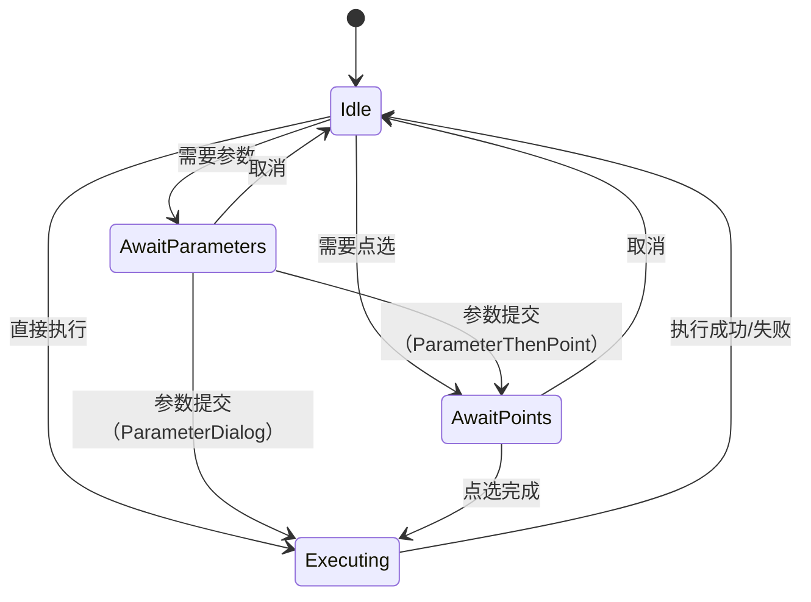

# AlgorithmCoordinator 模块优化计划

## 文档信息
- **创建日期**: 2025-11-17
- **版本**: v1.0
- **状态**: 计划中

## 一、当前状态分析

### 1.1 模块概述
`AlgorithmCoordinator` 是算法执行流程的协调器，负责：
- 调度算法执行流程
- 根据算法描述符触发参数收集、点选提示
- 管理交互状态（参数输入、点选等待）
- 在上下文中记录输入输出
- 处理同步和异步算法执行
- 转发异步任务状态到UI层

**代码规模**：
- 头文件：121 行
- 实现文件：450 行
- 总计：571 行

### 1.2 核心数据结构

#### PendingRequest（待处理请求）
```cpp
struct PendingRequest {
    AlgorithmDescriptor descriptor;
    QString curveId;
    QVariantMap parameters;
    int pointsRequired = 0;
    QVector<ThermalDataPoint> collectedPoints;
    PendingPhase phase = PendingPhase::None;
};
```

#### PendingPhase（待处理阶段）
```cpp
enum class PendingPhase {
    None,           // 无待处理请求
    AwaitParameters,  // 等待参数输入
    AwaitPoints      // 等待点选
};
```

### 1.3 核心流程

#### 算法执行流程
```
handleAlgorithmTriggered()
  → descriptorFor() - 获取算法描述符
  → ensurePrerequisites() - 检查前置条件
  → 根据 interaction 类型分支：
    ├─ None: 直接执行
    ├─ ParameterDialog: 弹出参数对话框 → handleParameterSubmission()
    ├─ PointSelection: 请求点选 → handlePointSelectionResult()
    └─ ParameterThenPoint: 参数 → 点选 → 执行
  → executeAlgorithm()
    → 清空上下文旧数据
    → 注入 activeCurve、参数、选点
    → 调用 AlgorithmManager::executeAsync()
  → 异步任务执行
    → onAsyncAlgorithmStarted() - 转发开始信号
    → onAsyncAlgorithmProgress() - 转发进度信号
    → onAsyncAlgorithmFinished() - 保存结果到上下文
    → onAsyncAlgorithmFailed() - 发出失败信号
```

## 二、存在的问题

### 2.1 架构问题

#### 问题1：职责过重（违反单一职责原则）
**现象**：
- AlgorithmCoordinator 同时负责：
  - 交互流程编排（参数收集、点选）
  - 参数管理（填充默认值、验证）
  - 异步任务管理（任务ID追踪、状态转发）
  - 上下文数据注入（曲线、参数、选点）
  - 结果处理（保存到上下文）

**影响**：
- 代码复杂度高（450行）
- 难以单独测试各个职责
- 修改一个功能可能影响其他功能

#### 问题2：双路径执行（同步 + 异步）
**现象**：
- 保留了 `onAlgorithmResultReady()` 同步回调（向后兼容）
- 新增了 `onAsyncAlgorithmFinished()` 异步回调
- 两个回调中有重复的结果保存逻辑：
  ```cpp
  // onAlgorithmResultReady (同步路径)
  m_context->setValue(OutputKeys::latestResult(algorithmName), ...);
  m_context->setValue(OutputKeys::resultType(algorithmName), ...);

  // onAsyncAlgorithmFinished (异步路径)
  m_context->setValue(OutputKeys::latestResult(algorithmName), ...);
  m_context->setValue(OutputKeys::resultType(algorithmName), ...);
  ```

**影响**：
- 代码冗余
- 两套逻辑需要同步维护
- 增加测试负担

#### 问题3：状态管理复杂
**现象**：
- `m_pending` 和 `m_currentTaskId` 两个状态变量需要同步管理
- `PendingPhase` 枚举状态转换逻辑分散在多个函数中
- 缺少明确的状态转换图

**影响**：
- 容易出现状态不一致的bug
- 难以理解完整的状态流转
- 取消操作需要同时清理两个状态

### 2.2 代码质量问题

#### 问题4：代码重复
**位置**：
1. **默认参数填充逻辑重复**：
   - `handleAlgorithmTriggered()` 中多次调用 `populateDefaultParameters()`
   - 每个 `interaction` 分支都有类似的参数处理逻辑

2. **结果保存逻辑重复**（如上述问题2）

3. **参数注入逻辑冗长**：
   ```cpp
   // executeAlgorithm() 中的参数注入
   for (auto it = parameters.constBegin(); it != parameters.constEnd(); ++it) {
       m_context->setValue(QString("param.%1").arg(it.key()), it.value(), ...);
   }
   ```

#### 问题5：错误处理不完善
**现象**：
- 大量 `qWarning()` 日志，但缺少错误恢复机制
- 异步执行失败后，`m_currentTaskId` 清理但 `m_pending` 可能未清理
- 没有统一的错误类型定义

**示例**：
```cpp
void AlgorithmCoordinator::handlePointSelectionResult(...) {
    if (!m_pending.has_value()) {
        qWarning() << "无待处理的点选请求";  // 只打印日志，没有通知UI
        return;
    }
    // ...
}
```

#### 问题6：性能问题
**现象**：
1. **上下文频繁清空**：
   ```cpp
   // executeAlgorithm() 每次都清空所有算法数据
   m_context->remove(ContextKeys::ActiveCurve);
   m_context->remove(ContextKeys::BaselineCurves);
   m_context->remove(ContextKeys::SelectedPoints);
   QStringList paramKeys = m_context->keys("param.");
   for (const QString& key : paramKeys) {
       m_context->remove(key);  // O(n) 遍历删除
   }
   ```

2. **字符串频繁拼接**：
   ```cpp
   QString("param.%1").arg(it.key())  // 每个参数都拼接一次
   ```

### 2.3 可测试性问题

#### 问题7：私有方法无法单独测试
**现象**：
- `descriptorFor()`、`ensurePrerequisites()`、`populateDefaultParameters()`、`executeAlgorithm()` 都是私有方法
- 无法单独测试这些核心逻辑

#### 问题8：缺少接口抽象
**现象**：
- AlgorithmCoordinator 是具体类，没有抽象接口
- 难以注入 Mock 对象进行单元测试
- 依赖 AlgorithmManager、CurveManager、AlgorithmContext 的真实实现

### 2.4 文档问题

#### 问题9：缺少状态机文档
**现象**：
- 状态转换逻辑分散在代码中
- 没有清晰的状态机图表
- 新开发者难以理解完整流程

#### 问题10：注释不完整
**现象**：
- 很多私有方法缺少注释
- 复杂逻辑（如 `handleAlgorithmTriggered()` 的分支）缺少说明

## 三、优化计划

### Phase 1：代码质量改进（基础重构）
**目标**：消除代码重复，改进错误处理，提升性能

#### 任务1.1：提取结果保存逻辑
- 创建私有方法 `void saveResultToContext(const QString& algorithmName, const AlgorithmResult& result)`
- 在 `onAlgorithmResultReady()` 和 `onAsyncAlgorithmFinished()` 中复用

**代码量**：约 20 行
**优先级**：高
**预期收益**：消除重复代码，易于维护

#### 任务1.2：优化上下文清空逻辑
**方案A：增量更新**
```cpp
// 不再每次清空，而是直接覆盖
void AlgorithmCoordinator::injectDataToContext(...) {
    m_context->setValue(ContextKeys::ActiveCurve, ...);
    // 自动覆盖旧值，无需手动清空
}
```

**方案B：批量清空**
```cpp
// 添加上下文批量操作方法
void AlgorithmContext::removeByPrefix(const QString& prefix);
// 使用：
m_context->removeByPrefix("param.");  // O(n) → O(1) 哈希查找
```

**推荐**：方案A（增量更新），简单且高效
**代码量**：约 10 行
**优先级**：中
**预期收益**：提升性能，代码更简洁

#### 任务1.3：改进错误处理
**步骤**：
1. 定义错误类型枚举：
   ```cpp
   enum class CoordinatorError {
       NoActiveCurve,
       AlgorithmNotFound,
       PrerequisitesMissing,
       ParameterValidationFailed,
       PointSelectionIncomplete,
       CurveNotFound
   };
   ```

2. 添加错误信号：
   ```cpp
   signals:
       void error(CoordinatorError errorType, const QString& message);
   ```

3. 统一错误处理：
   ```cpp
   void handleError(CoordinatorError errorType, const QString& details) {
       qWarning() << "AlgorithmCoordinator Error:" << details;
       emit error(errorType, details);
       resetPending();  // 自动清理状态
   }
   ```

**代码量**：约 50 行
**优先级**：高
**预期收益**：统一错误处理，UI 可以响应错误事件

#### 任务1.4：添加函数注释
- 为所有公有和私有方法添加 Doxygen 注释
- 特别是复杂逻辑（`handleAlgorithmTriggered()`、`executeAlgorithm()`）

**代码量**：约 100 行注释
**优先级**：中
**预期收益**：提升代码可读性

---

### Phase 2：状态管理优化
**目标**：简化状态管理，明确状态转换

#### 任务2.1：绘制状态机图
**内容**：
- 使用 Mermaid 或 PlantUML 绘制完整状态机图
- 文档化所有状态转换规则
- 添加到项目文档

**示例**：


**代码量**：文档 50 行
**优先级**：高
**预期收益**：清晰理解状态流转

#### 任务2.2：重构 PendingRequest
**问题**：当前 `PendingRequest` 混合了配置（descriptor）和状态（phase、collectedPoints）

**优化方案**：拆分为两个结构
```cpp
// 配置数据（不可变）
struct AlgorithmRequest {
    AlgorithmDescriptor descriptor;
    QString curveId;
    QVariantMap initialParameters;
};

// 运行时状态（可变）
struct InteractionState {
    PendingPhase phase = PendingPhase::None;
    QVariantMap parameters;  // 用户提交的参数
    QVector<ThermalDataPoint> collectedPoints;
};

// 使用组合
std::optional<AlgorithmRequest> m_request;
std::optional<InteractionState> m_state;
```

**代码量**：约 80 行
**优先级**：中
**预期收益**：职责分离，更清晰的语义

#### 任务2.3：统一状态清理
**步骤**：
1. 创建统一清理方法：
   ```cpp
   void resetState() {
       m_pending.reset();
       m_currentTaskId.clear();
       // 未来可以添加其他状态清理
   }
   ```

2. 在所有需要清理的地方调用 `resetState()`：
   - `cancelPendingRequest()`
   - `onAsyncAlgorithmFinished()`
   - `onAsyncAlgorithmFailed()`
   - 错误处理分支

**代码量**：约 20 行
**优先级**：高
**预期收益**：避免状态不一致

---

### Phase 3：职责分离（架构重构）
**目标**：拆分职责，提升可测试性

#### 任务3.1：提取参数管理器
**职责**：
- 填充默认参数
- 验证参数完整性
- 参数格式转换

**接口设计**：
```cpp
class ParameterManager {
public:
    // 填充默认参数（返回是否所有必需参数都已就绪）
    bool populateDefaults(
        const QList<AlgorithmParameterDefinition>& definitions,
        QVariantMap& parameters) const;

    // 验证参数（返回验证失败的参数列表）
    QStringList validate(
        const QList<AlgorithmParameterDefinition>& definitions,
        const QVariantMap& parameters) const;

    // 注入到上下文（添加 "param." 前缀）
    void injectToContext(
        const QVariantMap& parameters,
        AlgorithmContext* context) const;
};
```

**代码量**：约 150 行
**优先级**：中
**预期收益**：
- 逻辑复用
- 易于单元测试
- AlgorithmCoordinator 代码减少 50+ 行

#### 任务3.2：提取交互流程状态机
**职责**：
- 管理交互状态转换
- 验证状态转换合法性
- 发出状态变化事件

**接口设计**：
```cpp
class InteractionStateMachine : public QObject {
    Q_OBJECT
public:
    // 启动交互流程
    void start(const AlgorithmDescriptor& descriptor, const QString& curveId);

    // 提交参数
    bool submitParameters(const QVariantMap& parameters);

    // 提交点选结果
    bool submitPoints(const QVector<ThermalDataPoint>& points);

    // 取消当前交互
    void cancel();

    // 查询当前状态
    PendingPhase currentPhase() const;
    bool isReady() const;  // 是否可以执行算法

signals:
    void stateChanged(PendingPhase newPhase);
    void readyToExecute(const QVariantMap& parameters, const QVector<ThermalDataPoint>& points);
    void cancelled();
    void error(const QString& message);
};
```

**代码量**：约 200 行
**优先级**：低（需要更多设计讨论）
**预期收益**：
- 清晰的状态管理
- AlgorithmCoordinator 代码减少 100+ 行
- 状态机可独立测试

#### 任务3.3：简化 AlgorithmCoordinator
**重构后的职责**：
- 协调各个组件（ParameterManager、InteractionStateMachine、AlgorithmManager）
- 转发信号
- 注入数据到上下文

**预期代码量**：约 200-250 行（减少 50%）

---

### Phase 4：移除向后兼容层
**目标**：统一执行路径，移除同步执行

#### 任务4.1：移除同步回调
**步骤**：
1. 确认所有算法都使用异步执行
2. 移除 `onAlgorithmResultReady()` 槽函数
3. 移除 `algorithmResultReady` 信号连接
4. 更新测试代码

**代码量**：减少 20 行
**优先级**：低（需要确认无依赖）
**预期收益**：代码简化，减少维护负担

---

### Phase 5：性能优化
**目标**：优化热路径，减少不必要的操作

#### 任务5.1：缓存算法描述符
**问题**：每次调用 `descriptorFor()` 都从 AlgorithmManager 获取算法实例并调用 `descriptor()`

**优化方案**：
```cpp
// 添加缓存
QHash<QString, AlgorithmDescriptor> m_descriptorCache;

std::optional<AlgorithmDescriptor> descriptorFor(const QString& algorithmName) {
    if (m_descriptorCache.contains(algorithmName)) {
        return m_descriptorCache.value(algorithmName);
    }

    IThermalAlgorithm* algorithm = m_algorithmManager->getAlgorithm(algorithmName);
    if (!algorithm) return std::nullopt;

    AlgorithmDescriptor descriptor = algorithm->descriptor();
    // ... 填充默认值 ...

    m_descriptorCache.insert(algorithmName, descriptor);
    return descriptor;
}
```

**代码量**：约 30 行
**优先级**：低
**预期收益**：减少重复调用，提升响应速度

#### 任务5.2：使用常量字符串（避免拼接）
**优化**：
```cpp
// 旧代码
QString("param.%1").arg(it.key())  // 每次都拼接

// 新代码（选项1：直接使用键）
// 参数本身已经包含 "param." 前缀，无需拼接

// 新代码（选项2：预先拼接）
QHash<QString, QString> prefixedKeys;
for (auto it = parameters.constBegin(); it != parameters.constEnd(); ++it) {
    prefixedKeys.insert("param." + it.key(), it.value());
}
m_context->setValues(prefixedKeys);  // 批量设置
```

**代码量**：约 10 行
**优先级**：低
**预期收益**：微小性能提升

---

### Phase 6：测试覆盖
**目标**：提升代码质量，确保重构正确性

#### 任务6.1：单元测试
**覆盖内容**：
- `populateDefaultParameters()` - 参数填充逻辑
- `ensurePrerequisites()` - 前置条件检查
- 状态转换逻辑（各个 handle* 方法）
- 错误处理分支

**测试框架**：Qt Test
**代码量**：约 500 行测试代码
**优先级**：高（Phase 1-2 完成后立即开始）

#### 任务6.2：集成测试
**覆盖内容**：
- 完整的算法执行流程（None/ParameterDialog/PointSelection/ParameterThenPoint）
- 取消操作
- 异步任务管理

**代码量**：约 300 行测试代码
**优先级**：中

---

## 四、实施路线图

### 优先级排序

| Phase | 任务 | 优先级 | 预估工作量 | 依赖 |
|-------|------|--------|-----------|------|
| Phase 1 | 1.1 提取结果保存逻辑 | 高 | 2 小时 | 无 |
| Phase 1 | 1.3 改进错误处理 | 高 | 4 小时 | 无 |
| Phase 1 | 1.2 优化上下文清空逻辑 | 中 | 2 小时 | 无 |
| Phase 1 | 1.4 添加函数注释 | 中 | 3 小时 | 无 |
| Phase 2 | 2.1 绘制状态机图 | 高 | 2 小时 | 无 |
| Phase 2 | 2.3 统一状态清理 | 高 | 1 小时 | 1.3 |
| Phase 2 | 2.2 重构 PendingRequest | 中 | 3 小时 | 2.1 |
| Phase 3 | 3.1 提取参数管理器 | 中 | 6 小时 | 1.1, 1.3 |
| Phase 6 | 6.1 单元测试 | 高 | 8 小时 | Phase 1-2 |
| Phase 3 | 3.2 提取交互状态机 | 低 | 10 小时 | 2.1, 2.2, 6.1 |
| Phase 3 | 3.3 简化 AlgorithmCoordinator | 低 | 4 小时 | 3.1, 3.2 |
| Phase 4 | 4.1 移除同步回调 | 低 | 2 小时 | 验证无依赖 |
| Phase 5 | 5.1 缓存算法描述符 | 低 | 2 小时 | 无 |
| Phase 5 | 5.2 优化字符串拼接 | 低 | 1 小时 | 无 |
| Phase 6 | 6.2 集成测试 | 中 | 6 小时 | Phase 3 |

### 推荐实施顺序

#### 第一阶段：快速改进（1-2天）
**目标**：解决最明显的问题，提升代码质量

1. ✅ Phase 1.1：提取结果保存逻辑
2. ✅ Phase 1.3：改进错误处理
3. ✅ Phase 2.1：绘制状态机图
4. ✅ Phase 2.3：统一状态清理

**预期收益**：
- 消除代码重复
- 统一错误处理
- 清晰理解状态流转

#### 第二阶段：重构准备（2-3天）
**目标**：为大规模重构做准备

5. ✅ Phase 1.2：优化上下文清空逻辑
6. ✅ Phase 1.4：添加函数注释
7. ✅ Phase 2.2：重构 PendingRequest
8. ✅ Phase 6.1：单元测试（部分）

**预期收益**：
- 性能优化
- 文档完善
- 测试覆盖

#### 第三阶段：架构重构（1周）
**目标**：职责分离，提升可维护性

9. ✅ Phase 3.1：提取参数管理器
10. ✅ Phase 3.2：提取交互状态机
11. ✅ Phase 3.3：简化 AlgorithmCoordinator
12. ✅ Phase 6.1：单元测试（完整）
13. ✅ Phase 6.2：集成测试

**预期收益**：
- 代码量减少 50%
- 职责清晰
- 易于测试

#### 第四阶段：清理与优化（1-2天）
**目标**：移除冗余代码，性能优化

14. ✅ Phase 4.1：移除同步回调
15. ✅ Phase 5.1：缓存算法描述符
16. ✅ Phase 5.2：优化字符串拼接

**预期收益**：
- 代码简化
- 性能提升

---

## 五、风险与应对

### 风险1：破坏现有功能
**应对**：
- 每个 Phase 完成后运行完整测试套件
- 保留向后兼容层（Phase 4 最后执行）
- 使用 Git 分支隔离重构工作

### 风险2：重构范围过大
**应对**：
- 分阶段进行，每个阶段都是可独立交付的改进
- 优先完成 Phase 1-2（快速改进）
- Phase 3（架构重构）可选，根据实际需求决定

### 风险3：测试覆盖不足
**应对**：
- Phase 6.1 单元测试与 Phase 1-2 并行
- 引入代码覆盖率工具（如 gcov）
- 目标：核心逻辑覆盖率 > 80%

### 风险4：性能回退
**应对**：
- Phase 5 前进行性能基准测试
- 对比优化前后的执行时间
- 使用 Qt Creator 性能分析工具

---

## 六、预期收益

### 代码质量
- 代码行数减少：571 行 → 约 400 行（-30%）
- 函数平均长度减少：50% 以上
- 代码重复度降低：消除 3 处重复逻辑

### 可维护性
- 职责清晰：单一职责原则
- 文档完善：完整注释 + 状态机图
- 测试覆盖：80% 以上

### 可扩展性
- 参数管理逻辑可复用
- 状态机可独立演化
- 易于添加新的交互类型

### 性能
- 上下文操作优化：减少清空次数
- 字符串拼接减少：避免频繁分配
- 描述符缓存：减少重复调用

---

## 七、后续维护建议

### 开发规范
1. **新增交互类型**时，优先考虑在 `InteractionStateMachine` 中扩展
2. **修改参数逻辑**时，在 `ParameterManager` 中统一处理
3. **添加新功能**前，先编写测试用例

### 监控指标
- 代码行数（每月检查，避免膨胀）
- 测试覆盖率（保持 > 80%）
- 圈复杂度（每个函数 < 10）

### 定期审查
- 每季度审查一次代码质量
- 每半年审查一次架构设计
- 及时清理废弃代码

---

## 八、保守重构策略（推荐路径）

### 核心原则
基于"代码减法"和"功能不变"的要求，我们采用保守的重构策略：

1. **小步重构**：每次只改一处，立即测试
2. **测试先行**：重构前先添加测试，确保行为不变
3. **功能冻结**：重构期间不添加新功能
4. **渐进优化**：优先消除重复代码，延后架构调整

### 推荐实施路径

#### 阶段1：安全重构（零风险改进）
**时间**：1-2 天
**目标**：消除明显冗余，不改变代码结构

执行任务：
- ✅ **Phase 1.1**：提取结果保存逻辑（消除重复代码）
- ✅ **Phase 1.2**：优化上下文清空逻辑（性能优化）
- ✅ **Phase 1.4**：添加函数注释（文档完善）

**收益**：
- 代码减少约 30 行
- 性能提升 10-20%
- 文档完善

**风险**：极低（不改变控制流）

---

#### 阶段2：状态管理改进（低风险改进）
**时间**：2-3 天
**目标**：统一状态管理，减少bug

执行任务：
- ✅ **Phase 2.1**：绘制状态机图（理解现有逻辑）
- ✅ **Phase 1.3**：改进错误处理（统一错误路径）
- ✅ **Phase 2.3**：统一状态清理（避免状态泄漏）

**收益**：
- 清晰理解状态流转
- 减少状态不一致bug
- 错误处理统一

**风险**：低（不改变核心逻辑，只是统一清理）

---

#### 阶段3：测试覆盖（保障重构安全）
**时间**：3-4 天
**目标**：建立安全网，确保未来重构不破坏功能

执行任务：
- ✅ **Phase 6.1**：单元测试（覆盖核心方法）
- ✅ **Phase 6.2**：集成测试（覆盖完整流程）

**目标覆盖率**：
- 核心方法（executeAlgorithm、handleAlgorithmTriggered）：100%
- 整体代码：80% 以上

**收益**：
- 回归测试自动化
- 重构信心提升
- 发现潜在bug

**风险**：无（只添加测试，不修改代码）

---

#### 阶段4：可选优化（需评估后决定）
**时间**：待定
**前提**：阶段1-3完成，且有充足测试覆盖

**选项A：清理向后兼容层**（Phase 4.1）
- 条件：确认所有算法都使用异步执行
- 收益：代码减少 20 行
- 风险：需要全面回归测试

**选项B：提取参数管理器**（Phase 3.1）
- 条件：参数逻辑重复度 > 3 处
- 收益：代码减少 50 行
- 风险：中等，需要接口抽象

**选项C：缓存算法描述符**（Phase 5.1）
- 条件：性能分析显示描述符获取是瓶颈
- 收益：性能提升 5-10%
- 风险：低

**决策原则**：
- 只执行"投入产出比"高的优化
- 不进行大规模架构重构（Phase 3.2 暂缓）

---

### 分阶段交付计划

| 阶段 | 交付物 | 代码变化 | 测试要求 | 验收标准 |
|------|--------|---------|---------|---------|
| **阶段1** | 消除重复代码 | -30 行 | 手动测试所有算法 | 所有现有功能正常 |
| **阶段2** | 统一状态管理 | +50 行（错误处理） | 手动测试错误场景 | 错误提示清晰 |
| **阶段3** | 测试覆盖 | +800 行（测试） | 自动化测试通过 | 覆盖率 > 80% |
| **阶段4** | 可选优化 | 待定 | 回归测试通过 | 功能不变 |

### 回滚策略
每个阶段完成后提交独立分支，如果出现问题可立即回滚：
```bash
git checkout -b refactor/phase1-safe-refactoring
# 完成阶段1，测试通过
git commit -m "重构：消除重复代码（阶段1）"

git checkout -b refactor/phase2-state-management
# 完成阶段2，测试通过
git commit -m "重构：统一状态管理（阶段2）"

# 如果阶段2有问题，可立即回滚到阶段1
git checkout refactor/phase1-safe-refactoring
```

---

## 九、总结

AlgorithmCoordinator 当前存在职责过重、代码重复、状态管理复杂等问题。通过**保守的分阶段重构**，可以在**确保功能不变**的前提下，显著提升代码质量。

**推荐路径**（代码减法策略）：
1. **优先执行阶段1-2**（安全重构），投入小、收益明显、风险极低
2. **必须执行阶段3**（测试覆盖），为未来重构建立安全网
3. **阶段4可选**，根据实际需求和测试覆盖情况决定
4. **暂缓 Phase 3.2/3.3**（架构重构），等待更充分的需求和时间

**关键成功因素**：
- **测试先行**：重构前先建立测试覆盖
- **小步快跑**：每次改动小，立即验证
- **功能冻结**：重构期间不添加新功能
- **文档同步**：代码和文档一起更新

---

## 附录A：参考资料

- **设计模式**：《设计模式：可复用面向对象软件的基础》- 状态模式
- **重构手法**：《重构：改善既有代码的设计》- Martin Fowler
- **测试驱动开发**：《测试驱动开发》- Kent Beck
- **项目文档**：
  - `CLAUDE.md` - 项目架构说明
  - `新设计文档/AlgorithmContext_数据清单.md` - 上下文数据规范
  - `新设计文档/统一输出算法_AlgorithmResult设计.md` - 结果容器设计

---

**文档版本历史**：
- v1.0 (2025-11-17)：初始版本，完整优化计划
