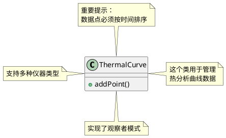
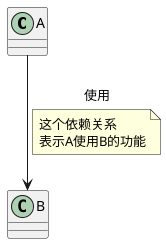
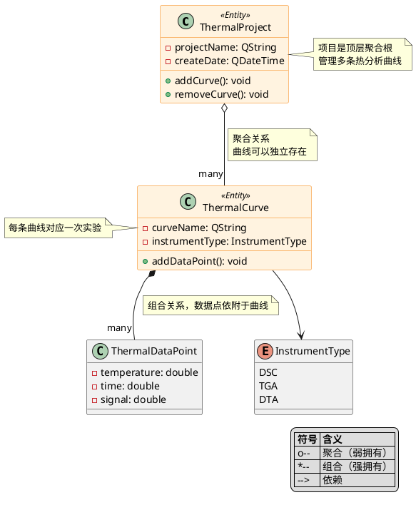

PlantUML中的**注释**有几种写法：

## 注释语法

### 1. 单行注释 `'`（单引号）

```plantuml
' 这是单行注释
class MyClass

' 定义颜色主题
skinparam class {
    BackgroundColor #E3F2FD
}
```

### 2. 多行注释 `/' ... '/`

```plantuml
/'
这是多行注释
可以写很多行
用于详细说明
'/

class MyClass {
    /' 
    这个方法用于处理数据
    参数说明：...
    '/
    +processData()
}
```

### 3. 图表中的注释/说明文字

#### 使用 `note` 关键字



#### 连接到关系的注释



## 完整示例



## 在Qt项目中添加注释

如果你要在Qt项目文档中使用PlantUML，可以这样组织：

```cpp
/**
 * @file ThermalCurve.h
 * @brief 热分析曲线类
 * 
 * @startuml
 * ' UML类图
 * class ThermalCurve {
 *     +addDataPoint()
 * }
 * @enduml
 */
class ThermalCurve {
    // C++代码
};
```

## 快捷输入方式

### 在不同编辑器中：

**VS Code / Qt Creator:**

- 单引号 `'` 直接输入
- 多行注释 `/'` + `'/`

**键盘输入：**

- 单引号：键盘上数字1左边的按键（中文输入法下可能需要切换到英文）
- `/`：问号键（中文下可能是顿号）

### 中文输入法下的注意事项

```plantuml
' 正确：英文单引号
' 错误：中文单引号（全角）

/' 正确 '/
/＇ 错误 ＇/  ← 这是全角符号，不会生效
```

## 推荐的注释风格

```plantuml
@startuml
' ============================================
' 文件信息区
' ============================================
' 文件名: domain_model.puml
' 作者: Zhang San
' 日期: 2025-11-03
' 版本: 1.0

' ============================================
' 颜色定义区
' ============================================
skinparam class {
    BackgroundColor #E8F5E9
}

' ============================================
' 类定义区
' ============================================
class MyClass {
    ' 属性定义
    -field1: int
    
    ' 方法定义
    +method1(): void
}

' ============================================
' 关系定义区
' ============================================
ClassA --> ClassB

@enduml
```



这样的注释风格清晰明了，方便维护。对于追求高级开发的你来说，良好的文档和注释习惯非常重要！