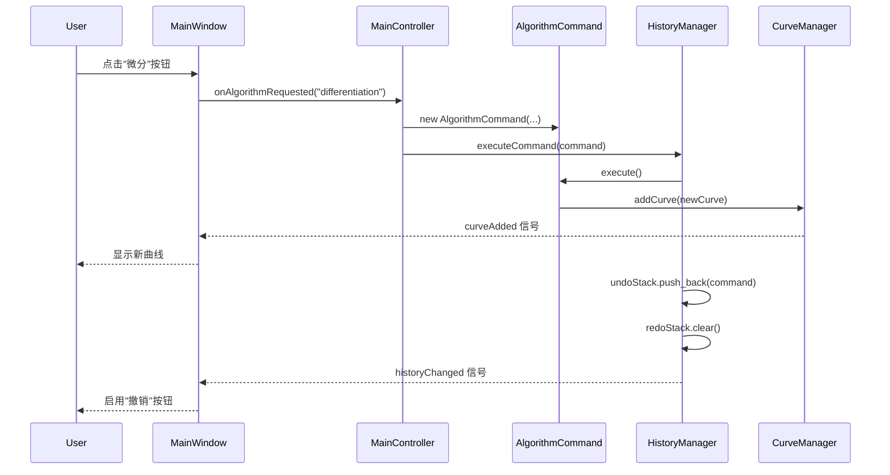
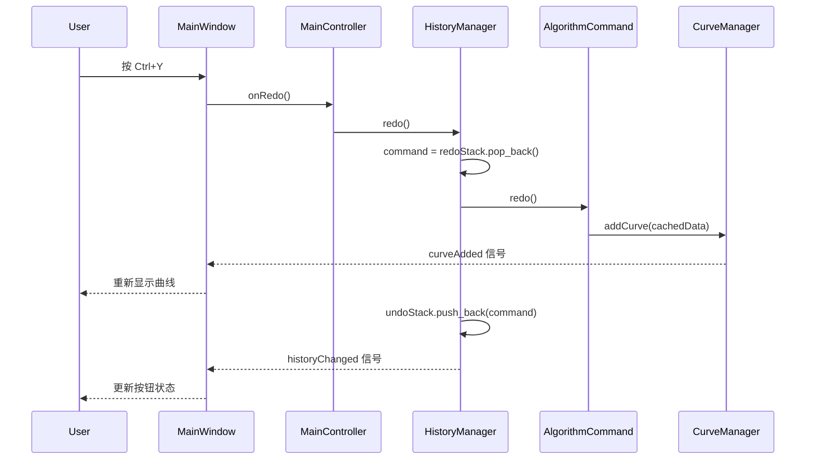

# 撤销/重做功能实现文档

## 📋 目录
- [概述](#概述)
- [架构设计](#架构设计)
- [核心组件](#核心组件)
- [工作流程](#工作流程)
- [关键实现细节](#关键实现细节)
- [使用指南](#使用指南)
- [扩展指南](#扩展指南)

---

## 概述

### 功能描述
撤销/重做功能允许用户撤销算法操作（微分、积分、移动平均等），并在需要时重做这些操作。该功能基于**命令模式**（Command Pattern）实现，完全符合项目的 DDD 四层架构设计。

### 设计目标
- ✅ **完整的撤销/重做支持** - 用户可以撤销和重做多次算法操作
- ✅ **符合架构图设计** - 严格按照 `简化架构图.puml` 中的设计实现
- ✅ **易于扩展** - 新的可撤销操作只需实现 `ICommand` 接口
- ✅ **内存管理** - 历史深度限制，防止内存无限增长
- ✅ **UI响应** - 自动启用/禁用撤销/重做按钮，提供快捷键支持

### 架构位置
```
领域层 (Domain Layer)
  └─ ICommand 接口
应用层 (Application Layer)
  ├─ HistoryManager (历史管理器)
  └─ AlgorithmCommand (算法命令实现)
表示层 (Presentation Layer)
  └─ MainWindow (UI集成)
```

---

## 架构设计

### 设计模式：命令模式 (Command Pattern)

命令模式将"请求"封装为对象，从而使用户可以用不同的请求对客户进行参数化；对请求排队或记录请求日志，以及支持可撤销的操作。

```
┌─────────────────────────────────────────────────────────────┐
│                      命令模式结构                             │
├─────────────────────────────────────────────────────────────┤
│                                                               │
│  ICommand (接口)                                              │
│  ├─ execute()  : 执行命令                                     │
│  ├─ undo()     : 撤销命令                                     │
│  ├─ redo()     : 重做命令                                     │
│  └─ description() : 命令描述                                  │
│                                                               │
│  HistoryManager (管理器)                                      │
│  ├─ undoStack : 撤销栈                                        │
│  ├─ redoStack : 重做栈                                        │
│  └─ executeCommand() : 执行并记录命令                         │
│                                                               │
│  AlgorithmCommand (具体命令)                                  │
│  └─ 实现 ICommand 接口                                        │
│                                                               │
└─────────────────────────────────────────────────────────────┘
```

### 数据流

```
用户操作
    ↓
MainWindow (UI层)
    ↓
MainController (控制器)
    ↓
创建 AlgorithmCommand
    ↓
HistoryManager.executeCommand()
    ↓
    ├─ execute() → 创建新曲线
    ├─ 添加到 undoStack
    └─ 清空 redoStack

撤销操作
    ↓
HistoryManager.undo()
    ↓
    ├─ 从 undoStack 弹出命令
    ├─ command.undo() → 删除曲线
    └─ 移动命令到 redoStack

重做操作
    ↓
HistoryManager.redo()
    ↓
    ├─ 从 redoStack 弹出命令
    ├─ command.redo() → 重新添加曲线
    └─ 移动命令回 undoStack
```

---

## 核心组件

### 1. ICommand 接口（领域层）

**文件位置**: `src/domain/algorithm/ICommand.h`

```cpp
class ICommand
{
public:
    virtual ~ICommand() = default;

    // 执行命令
    virtual bool execute() = 0;

    // 撤销命令
    virtual bool undo() = 0;

    // 重做命令（默认实现为再次执行）
    virtual bool redo() { return execute(); }

    // 返回命令描述（用于日志和UI显示）
    virtual QString description() const = 0;

    // 判断命令是否可以被撤销
    virtual bool canUndo() const { return true; }
};
```

**设计要点**：
- 纯虚接口，定义命令的标准行为
- 所有可撤销的操作都必须实现此接口
- `redo()` 提供默认实现，子类可选择性覆盖以优化性能

---

### 2. HistoryManager（应用层）

**文件位置**: `src/application/history/HistoryManager.h/cpp`

```cpp
class HistoryManager : public QObject
{
    Q_OBJECT

public:
    // 单例模式
    static HistoryManager& instance(QObject *parent = nullptr);

    // 执行命令并添加到历史记录
    bool executeCommand(std::unique_ptr<ICommand> command);

    // 撤销最近的命令
    bool undo();

    // 重做最近被撤销的命令
    bool redo();

    // 查询状态
    bool canUndo() const;
    bool canRedo() const;
    int undoCount() const;
    int redoCount() const;

    // 配置
    void setHistoryLimit(int limit);
    int historyLimit() const;
    void clear();

signals:
    // 历史状态改变时发射（用于更新UI）
    void historyChanged();

private:
    std::vector<std::unique_ptr<ICommand>> m_undoStack;  // 撤销栈
    std::vector<std::unique_ptr<ICommand>> m_redoStack;  // 重做栈
    int m_historyLimit;  // 历史记录最大深度（默认50）
};
```

**关键特性**：
1. **单例模式** - 全局唯一的历史管理器实例
2. **智能指针管理** - 使用 `std::unique_ptr` 自动管理命令对象的生命周期
3. **双栈结构** - 撤销栈和重做栈分别管理历史记录
4. **历史深度限制** - 防止内存无限增长
5. **信号通知** - 历史状态改变时自动通知UI更新

**内存管理策略**：
```cpp
// 执行新命令时
executeCommand() {
    undoStack.push_back(command);  // 添加到撤销栈
    redoStack.clear();             // 清空重做栈（历史分支失效）
    enforceHistoryLimit();         // 限制栈大小
}

// 撤销时
undo() {
    command = undoStack.pop_back();
    command->undo();
    redoStack.push_back(command);  // 移到重做栈
}

// 重做时
redo() {
    command = redoStack.pop_back();
    command->redo();
    undoStack.push_back(command);  // 移回撤销栈
}
```

---

### 3. AlgorithmCommand（应用层）

**文件位置**: `src/application/history/AlgorithmCommand.h/cpp`

```cpp
class AlgorithmCommand : public ICommand
{
public:
    AlgorithmCommand(IThermalAlgorithm* algorithm,
                     ThermalCurve* inputCurve,
                     CurveManager* curveManager,
                     const QString& algorithmName);

    bool execute() override;
    bool undo() override;
    bool redo() override;
    QString description() const override;

private:
    IThermalAlgorithm* m_algorithm;      // 算法指针
    ThermalCurve* m_inputCurve;          // 输入曲线
    CurveManager* m_curveManager;        // 曲线管理器
    QString m_algorithmName;             // 算法名称

    QString m_newCurveId;                // 新创建的曲线ID
    ThermalCurve m_newCurveData;         // 新曲线的完整数据（用于重做）
    bool m_executed;                     // 是否已执行
};
```

**实现策略**：

#### execute() - 创建新曲线
```cpp
bool AlgorithmCommand::execute()
{
    // 1. 执行算法处理
    outputData = m_algorithm->process(m_inputCurve->getProcessedData());

    // 2. 创建新曲线
    m_newCurveId = QUuid::createUuid().toString();
    m_newCurveData = ThermalCurve(m_newCurveId, m_algorithm->displayName());

    // 3. 填充曲线数据和元数据
    m_newCurveData.setProcessedData(outputData);
    m_newCurveData.setParentId(m_inputCurve->id());
    // ... 设置其他属性

    // 4. 添加到 CurveManager
    m_curveManager->addCurve(m_newCurveData);
    m_curveManager->setActiveCurve(m_newCurveId);

    m_executed = true;
    return true;
}
```

#### undo() - 删除新曲线
```cpp
bool AlgorithmCommand::undo()
{
    // 从 CurveManager 删除新创建的曲线
    return m_curveManager->removeCurve(m_newCurveId);
}
```

#### redo() - 重新添加曲线
```cpp
bool AlgorithmCommand::redo()
{
    // 使用缓存的数据重新添加曲线（避免重新计算）
    m_curveManager->addCurve(m_newCurveData);
    m_curveManager->setActiveCurve(m_newCurveId);
    return true;
}
```

**优化亮点**：
- ✅ **缓存算法结果** - `m_newCurveData` 保存完整曲线数据，重做时无需重新计算
- ✅ **保持ID一致** - 撤销后重做，曲线ID保持不变
- ✅ **自动UI更新** - 通过 CurveManager 的信号自动触发UI刷新

---

### 4. UI集成（表示层）

**文件位置**: `src/ui/mainwindow.cpp`

#### 创建撤销/重做按钮

```cpp
QToolBar *MainWindow::createFileToolBar()
{
    // ...

    // 创建撤销按钮
    m_undoAction = toolbar->addAction(
        this->style()->standardIcon(QStyle::SP_ArrowBack),
        tr("撤销")
    );
    m_undoAction->setShortcut(QKeySequence::Undo);  // Ctrl+Z
    m_undoAction->setShortcutContext(Qt::ApplicationShortcut);
    m_undoAction->setEnabled(false);
    this->addAction(m_undoAction);  // 添加到窗口以全局可用

    // 创建重做按钮
    m_redoAction = toolbar->addAction(
        this->style()->standardIcon(QStyle::SP_ArrowForward),
        tr("重做")
    );
    m_redoAction->setShortcut(QKeySequence::Redo);  // Ctrl+Y
    m_redoAction->setShortcutContext(Qt::ApplicationShortcut);
    m_redoAction->setEnabled(false);
    this->addAction(m_redoAction);

    return toolbar;
}
```

#### 连接信号和更新UI状态

```cpp
void MainWindow::initComponents()
{
    // 连接按钮到控制器
    connect(m_undoAction, &QAction::triggered,
            m_mainController, &MainController::onUndo);
    connect(m_redoAction, &QAction::triggered,
            m_mainController, &MainController::onRedo);

    // 监听历史状态变化，自动更新按钮状态
    connect(&HistoryManager::instance(), &HistoryManager::historyChanged,
            this, [this]() {
        HistoryManager& historyManager = HistoryManager::instance();
        m_undoAction->setEnabled(historyManager.canUndo());
        m_redoAction->setEnabled(historyManager.canRedo());
    });
}
```

**UI特性**：
- ✅ **快捷键支持** - Ctrl+Z (撤销), Ctrl+Y (重做)
- ✅ **应用程序级别** - 快捷键在任何焦点状态下都可用
- ✅ **动态启用/禁用** - 根据历史状态自动更新按钮
- ✅ **标准图标** - 使用系统标准的后退/前进图标

---

## 工作流程

### 执行算法流程



### 撤销流程


### 重做流程



---

## 关键实现细节

### 1. 为什么使用 std::vector 而不是 QStack？

**问题**：Qt 的 QStack 不支持 `std::unique_ptr`
```cpp
// 编译错误！
QStack<std::unique_ptr<ICommand>> m_undoStack;
```

**原因**：
- QStack 基于 QVector，在内部操作中会尝试拷贝元素
- `std::unique_ptr` 禁止拷贝，只能移动

**解决方案**：使用 `std::vector` 模拟栈
```cpp
std::vector<std::unique_ptr<ICommand>> m_undoStack;

// 入栈
m_undoStack.push_back(std::move(command));

// 出栈
auto command = std::move(m_undoStack.back());
m_undoStack.pop_back();
```

---

### 2. 历史深度限制实现

**目标**：防止历史记录无限增长，导致内存溢出

```cpp
void HistoryManager::enforceHistoryLimit()
{
    // 如果撤销栈超过限制，移除最旧的命令（从开头移除）
    while (static_cast<int>(m_undoStack.size()) > m_historyLimit) {
        m_undoStack.erase(m_undoStack.begin());
    }
}
```

**配置**：
- 默认限制：50 步
- 可通过 `setHistoryLimit()` 调整
- 只限制撤销栈，重做栈不需要限制（执行新命令时会清空）

---

### 3. 为什么撤销/重做不直接修改现有曲线？

**设计决策**：创建新曲线 vs 修改现有曲线

#### 最初设计（有问题）
```cpp
execute() {
    // 修改现有曲线
    m_curve->setProcessedData(newData);
}

undo() {
    // 恢复旧数据
    m_curve->setProcessedData(oldData);
}
```

**问题**：
- ❌ 用户期望算法生成**新曲线**，而不是修改原曲线
- ❌ 原始数据和算法结果应该分开显示
- ❌ 与原有 AlgorithmService 的行为不一致

#### 当前设计（正确）
```cpp
execute() {
    // 创建新曲线
    m_curveManager->addCurve(newCurve);
}

undo() {
    // 删除新曲线
    m_curveManager->removeCurve(newCurveId);
}

redo() {
    // 重新添加曲线（使用缓存数据）
    m_curveManager->addCurve(m_newCurveData);
}
```

**优点**：
- ✅ 符合用户期望
- ✅ 保留原始曲线和算法结果
- ✅ 与架构设计一致
- ✅ 支持父子曲线关系

---

### 4. 快捷键全局可用的实现

**问题**：默认快捷键只在特定焦点状态下工作

**解决方案**：
```cpp
// 1. 设置快捷键上下文为应用程序级别
m_undoAction->setShortcutContext(Qt::ApplicationShortcut);

// 2. 将 Action 添加到 MainWindow
this->addAction(m_undoAction);
```

**效果**：
- 无论焦点在图表、树形视图还是其他控件，快捷键都能响应
- 用户体验与主流应用一致

---

### 5. Lambda 捕获的注意事项

**问题代码**（可能导致悬空引用）：
```cpp
HistoryManager& historyManager = HistoryManager::instance();
connect(&historyManager, ..., [this, &historyManager]() {
    // 捕获局部变量引用，可能导致问题
    m_undoAction->setEnabled(historyManager.canUndo());
});
```

**正确代码**：
```cpp
connect(&HistoryManager::instance(), ..., [this]() {
    // 在 lambda 内部获取单例实例，更安全
    HistoryManager& historyManager = HistoryManager::instance();
    m_undoAction->setEnabled(historyManager.canUndo());
});
```

**原因**：
- 单例实例的生命周期长于连接
- 避免捕获局部引用变量
- 更清晰的意图表达

---

## 使用指南

### 用户操作

#### 基本操作
1. **导入数据** - 使用"导入数据"按钮加载热分析数据文件
2. **执行算法** - 在"热力学"Tab 中点击算法按钮（微分/积分/移动平均）
3. **撤销操作** - 点击撤销按钮或按 **Ctrl+Z**
4. **重做操作** - 点击重做按钮或按 **Ctrl+Y** (Windows) / **Ctrl+Shift+Z** (Mac)

#### 典型使用场景

**场景1：尝试不同算法**
```
1. 导入数据
2. 执行微分算法 → 生成"微分"曲线
3. 觉得不满意，按 Ctrl+Z 撤销 → "微分"曲线消失
4. 执行移动平均算法 → 生成"滤波"曲线
5. 效果不错，继续操作
```

**场景2：对比算法结果**
```
1. 导入数据
2. 执行微分算法 → 生成"微分"曲线
3. 执行移动平均算法（对微分曲线） → 生成"滤波"曲线
4. 按 Ctrl+Z 撤销滤波 → 只保留微分曲线
5. 按 Ctrl+Y 重做 → 滤波曲线重新出现
6. 来回对比，选择最佳结果
```

**场景3：撤销多步操作**
```
1. 导入数据
2. 执行操作1 → 曲线A
3. 执行操作2 → 曲线B
4. 执行操作3 → 曲线C
5. 连续按 Ctrl+Z 三次 → 回到初始状态
6. 连续按 Ctrl+Y 三次 → 恢复所有操作
```

#### UI反馈
- 📌 **按钮状态**：
  - 灰色禁用 = 无法执行该操作
  - 正常显示 = 可以执行该操作
- 📌 **快捷键提示**：
  - 鼠标悬停在按钮上可查看快捷键
- 📌 **历史深度**：
  - 最多保留 50 步历史记录
  - 超过限制后，最早的操作将被遗忘

---

## 扩展指南

### 如何添加新的可撤销操作？

假设您要添加"基线校正"操作的撤销/重做支持：

#### 步骤1：创建命令类

```cpp
// src/application/history/BaselineCorrectionCommand.h
#include "domain/algorithm/ICommand.h"

class BaselineCorrectionCommand : public ICommand
{
public:
    BaselineCorrectionCommand(/* 构造参数 */);

    bool execute() override {
        // 执行基线校正
        // ...
        return true;
    }

    bool undo() override {
        // 撤销基线校正
        // ...
        return true;
    }

    bool redo() override {
        // 重做基线校正
        // ...
        return true;
    }

    QString description() const override {
        return "基线校正操作";
    }

private:
    // 保存必要的数据以支持撤销/重做
};
```

#### 步骤2：在控制器中使用

```cpp
// src/ui/controller/MainController.cpp
void MainController::onBaselineCorrection()
{
    // 1. 获取活动曲线
    ThermalCurve* activeCurve = m_curveManager->getActiveCurve();
    if (!activeCurve) return;

    // 2. 创建命令
    auto command = std::make_unique<BaselineCorrectionCommand>(
        activeCurve, /* 其他参数 */);

    // 3. 执行命令
    m_historyManager->executeCommand(std::move(command));
}
```

#### 步骤3：更新项目文件

```qmake
# Analysis.pro
HEADERS += src/application/history/BaselineCorrectionCommand.h
SOURCES += src/application/history/BaselineCorrectionCommand.cpp
```

### 命令设计最佳实践

#### ✅ 良好设计
```cpp
class GoodCommand : public ICommand
{
private:
    // 保存指针（不拥有）
    ThermalCurve* m_curve;

    // 保存必要的状态数据
    QVector<ThermalDataPoint> m_oldData;
    QVector<ThermalDataPoint> m_newData;

    // 标记执行状态
    bool m_executed;
};
```

#### ❌ 避免
```cpp
class BadCommand : public ICommand
{
private:
    // ❌ 不要保存大量冗余数据
    QVector<ThermalCurve> m_allCurves;

    // ❌ 不要在命令中执行耗时计算
    void heavyComputation() { /* ... */ }

    // ❌ 不要使用全局变量
    static int globalState;
};
```

### 性能优化建议

#### 1. 缓存重做数据
```cpp
bool AlgorithmCommand::execute()
{
    // 执行算法
    m_newData = algorithm->process(inputData);

    // 缓存结果，重做时直接使用
    m_newCurveData.setProcessedData(m_newData);

    return true;
}

bool AlgorithmCommand::redo()
{
    // 直接使用缓存数据，不重新计算
    m_curveManager->addCurve(m_newCurveData);
    return true;
}
```

#### 2. 使用移动语义
```cpp
// ✅ 使用 std::move 避免拷贝
m_historyManager->executeCommand(std::move(command));

// ❌ 不要拷贝大对象
// m_historyManager->executeCommand(command);  // 错误！
```

#### 3. 合理设置历史深度
```cpp
// 根据应用场景调整
HistoryManager::instance().setHistoryLimit(100);  // 允许更多历史

// 或者降低限制以节省内存
HistoryManager::instance().setHistoryLimit(20);
```

---

## 架构优势

### 1. 松耦合设计
- ICommand 接口独立于具体实现
- HistoryManager 不依赖具体的命令类型
- UI 层不需要了解命令的内部实现

### 2. 易于测试
```cpp
// 单元测试示例
TEST(HistoryManagerTest, UndoRedo)
{
    HistoryManager& manager = HistoryManager::instance();

    // 创建模拟命令
    auto command = std::make_unique<MockCommand>();

    // 测试执行
    ASSERT_TRUE(manager.executeCommand(std::move(command)));
    ASSERT_TRUE(manager.canUndo());

    // 测试撤销
    ASSERT_TRUE(manager.undo());
    ASSERT_TRUE(manager.canRedo());

    // 测试重做
    ASSERT_TRUE(manager.redo());
}
```

### 3. 符合 SOLID 原则
- **单一职责**：每个类只负责一个功能
- **开闭原则**：对扩展开放（新命令），对修改封闭
- **里氏替换**：所有命令都可以替换使用
- **接口隔离**：ICommand 接口精简
- **依赖倒置**：依赖抽象（ICommand）而非具体实现

### 4. 完全遵循架构图
```
✅ ICommand 接口       → 领域层（Domain Layer）
✅ HistoryManager      → 应用层（Application Layer）
✅ AlgorithmCommand    → 应用层（Application Layer）
✅ MainWindow 集成     → 表示层（Presentation Layer）
```

---

## 常见问题 (FAQ)

### Q1: 为什么撤销后，曲线的 ID 会变化？
**A**: 不会变化。AlgorithmCommand 保存了原始的曲线 ID (`m_newCurveId`)，撤销后重做时会使用相同的 ID。

### Q2: 历史记录会占用多少内存？
**A**: 每个命令保存一条曲线的完整数据。以默认限制 50 步计算：
- 每条曲线约 1-10 MB（取决于数据点数量）
- 50 条曲线最多约 500 MB
- 可通过 `setHistoryLimit()` 调整限制

### Q3: 关闭程序后，历史记录会保存吗？
**A**: 不会。当前实现的历史记录是内存中的，程序关闭后会丢失。如需持久化，需要实现历史记录的序列化。

### Q4: 可以撤销"导入数据"操作吗？
**A**: 当前版本不支持。只有算法操作可以撤销。如需支持，需要创建 `ImportDataCommand`。

### Q5: 撤销/重做是线程安全的吗？
**A**: 当前实现假定所有操作都在 UI 线程。如果需要多线程支持，需要添加互斥锁保护。

---

## 未来扩展方向

### 1. 持久化历史记录
```cpp
// 保存历史记录到文件
HistoryManager::instance().saveHistory("history.dat");

// 从文件加载历史记录
HistoryManager::instance().loadHistory("history.dat");
```

### 2. 历史记录可视化
```cpp
// 显示历史记录列表
QListWidget* historyList = new QListWidget();
for (int i = 0; i < manager.undoCount(); i++) {
    historyList->addItem(manager.getCommand(i)->description());
}
```

### 3. 选择性撤销
```cpp
// 撤销到特定的历史点
manager.undoTo(5);  // 撤销到第5步

// 跳过某些命令
manager.undo(skipCommand);
```

### 4. 宏命令支持
```cpp
// 将多个命令组合为一个
MacroCommand macro;
macro.addCommand(command1);
macro.addCommand(command2);
manager.executeCommand(std::move(macro));
// 撤销时，一次性撤销所有子命令
```

---

## 总结

撤销/重做功能的实现完全遵循了项目的 DDD 四层架构设计，采用**命令模式**实现了灵活、可扩展的历史管理系统。主要特点包括：

✅ **架构清晰** - 严格遵循分层架构，职责明确
✅ **易于扩展** - 新操作只需实现 ICommand 接口
✅ **性能优化** - 缓存重做数据，避免重复计算
✅ **用户友好** - 快捷键支持，自动UI更新
✅ **内存可控** - 历史深度限制，防止内存溢出

该设计不仅满足当前需求，还为未来功能扩展预留了充足的空间。

---

## 参考资料

- **设计模式**：《设计模式：可复用面向对象软件的基础》- Command Pattern
- **架构设计**：项目根目录 `设计图/简化架构图.puml`
- **Qt 文档**：[QAction Class](https://doc.qt.io/qt-5/qaction.html)
- **C++ 标准库**：[std::unique_ptr](https://en.cppreference.com/w/cpp/memory/unique_ptr)

---

**文档版本**: 1.0
**最后更新**: 2025-01-02
**作者**: Claude (Anthropic)
**项目**: 热分析软件 - Analysis
